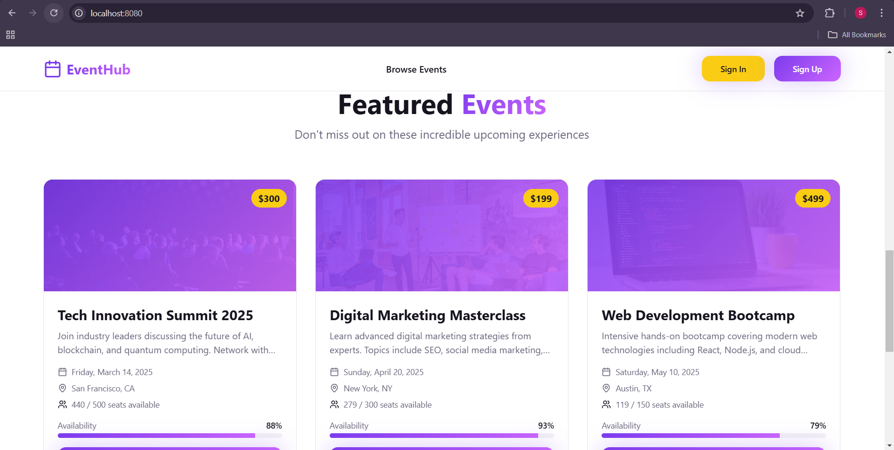

---

# Smart Event Booking System

A full-stack MERN-style (React + Node.js + MySQL) application for browsing, booking, creating, and managing events with user authentication and an admin dashboard.

---

## 🚀 Tech Stack

### **Frontend**

* React + TypeScript
* Vite
* Tailwind CSS
* React Router
* React Query
* Axios

### **Backend**

* Node.js
* Express.js
* MySQL (mysql2)
* JWT Authentication
* REST API

---

## 📌 Features

### User

* Register & Login
* Browse all events
* Event details
* Booking system
* Search & filter

### Admin

* Admin-only protected dashboard
* Create, edit, delete events
* View event statistics

---

## 🖼️ Screenshots

### Home Page




### Events Page


### Admin Dashboard


---


## 📦 Installation

### 1️⃣ Clone the repo

```bash
git clone <YOUR_REPO_URL>
cd project
```

### 2️⃣ Install frontend

```bash
cd client
npm install
npm run dev
```

### 3️⃣ Install backend

```bash
cd ../server
npm install
npm start
```

---

## 🔗 API Setup

Create a `.env` file in **client**:

```
VITE_API_URL=http://localhost:5000/api
```

Create a `.env` file in **server**:

```
DB_HOST=localhost
DB_USER=root
DB_PASS=yourpassword
DB_NAME=eventify_db
DB_PORT=3306
JWT_SECRET=your_secret
```

---

## 📄 Detailed Documentation

For full instructions, configurations, and architecture:

👉 **See `/client/README.md`** (full frontend guide)
👉 **See `/server/README.md`** (full backend guide)

---

## ✔ Status

Project ready for local development & deployment.

---
