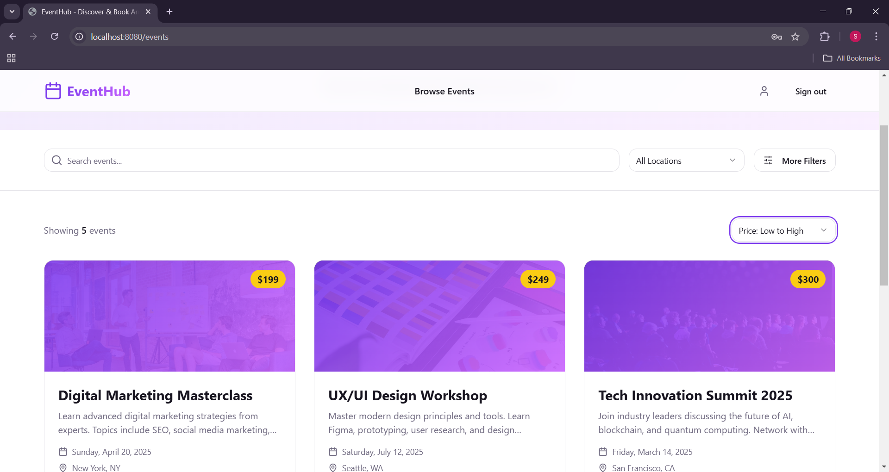
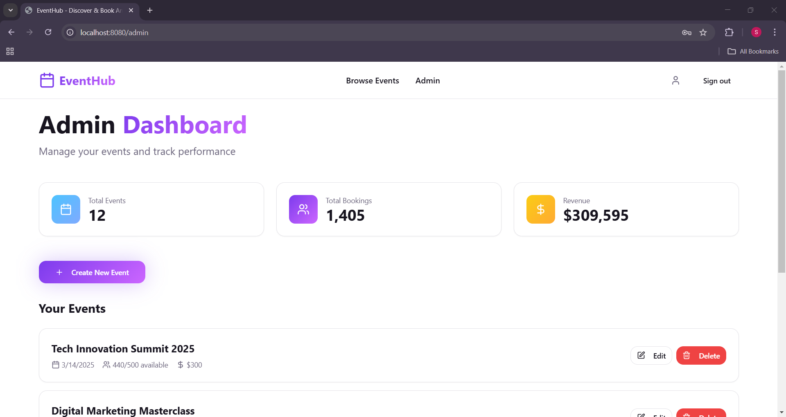

---

# Smart Event Booking System — Frontend

A modern, full-stack event booking application built with **React, TypeScript, Vite, Tailwind CSS, shadcn-ui**, and **React Query**.
This repository contains the **frontend** that communicates with a Node.js + Express + MySQL backend.

---

## 🚀 Features

### 👤 User Features

* User registration & login
* JWT-based authentication (with context)
* Browse all events
* View individual event details
* Book events (name, email, mobile, quantity)
* Client-side search & filtering
* Real-time seat availability
* Responsive UI

### 🔐 Admin Features

* Protected Admin Dashboard (visible only to `admin = yes`)
* Create new events
* Edit events (with pre-filled form)
* Delete events
* View event statistics
* React Query mutation-based CRUD

### 🎨 UI & Animation

* Beautiful shadcn-ui components
* Tailwind CSS styling
* Framer Motion animations
* Gradient & glassmorphism effects

---

## 🛠️ Tech Stack

### **Frontend**

| Technology             | Purpose                    |
| ---------------------- | -------------------------- |
| **React (TypeScript)** | UI Framework               |
| **Vite**               | Development bundler        |
| **Tailwind CSS**       | Styling                    |
| **shadcn/ui**          | Prebuilt components        |
| **React Router**       | Routing                    |
| **React Query**        | Server state & API caching |
| **axios**              | HTTP client                |
| **Framer Motion**      | Animations                 |

### **Backend**

* Node.js + Express
* MySQL + mysql2
* JWT Authentication

---

## 📁 Folder Structure

```
client/
│── public/
│── src/
│   ├── assets/             # Images & media
│   ├── components/         # Reusable UI components
│   ├── contexts/           # AuthContext (JWT handling)
│   ├── hooks/              # React Query hooks
│   ├── lib/                # Axios client, config
│   ├── pages/              # Route pages (Home, Events, Admin…)
│   ├── types/              # TypeScript interfaces
│   ├── App.tsx             # Main routing file
│   ├── main.tsx            # Entry point
│── .env                    # Frontend environment variables
│── package.json
│── vite.config.ts
│── README.md
```

---

## ⚙️ Environment Variables

Create a `.env` file inside **client/**:

```
VITE_API_URL=http://localhost:5000/api
```

Or, if deployed:

```
VITE_API_URL=https://your-backend-domain.com/api
```

---

## 📦 Installation & Setup

### 1️⃣ Clone the repository

```bash
git clone <YOUR_FRONTEND_GIT_URL>
cd <PROJECT_NAME>
```

### 2️⃣ Install dependencies

```bash
npm install
```

### 3️⃣ Start the development server

```bash
npm run dev
```

### 4️⃣ Build production bundle (optional)

```bash
npm run build
```

---

## 🔗 API Integration

All backend requests use an axios instance located at:

```
src/lib/apiClient.ts
```

Example:

```ts
apiClient.get('/events');
apiClient.post('/auth/login', credentials);
```

React Query handles:

* caching
* invalidation
* auto-refresh
* success/error handling

---

## 🧩 Key Routes

| Route         | Description                 |
| ------------- | --------------------------- |
| `/`           | Home Page                   |
| `/events`     | View all events             |
| `/events/:id` | Event details               |
| `/login`      | User login                  |
| `/register`   | User registration           |
| `/admin`      | Admin dashboard (protected) |

---

## 🔒 Authentication Flow

* User logs in → backend returns a **JWT token**.
* Token is stored in **localStorage**.
* `AuthContext` exposes:

  ```ts
  user, isAuthenticated, isAdmin, login(), logout()
  ```
* Navbar conditionally shows:

  * Admin button (only admin)
  * Login/Signup for guest
  * Logout for authenticated users

---

## 🖼️ Screenshots 

```
## 📸 Screenshots

### Home Page

(./public/screenshots/home2.png)

### Events Page


### Admin Dashboard

```

---


## 🚀 Deployment

### Deploy frontend on:

* Vercel
* Netlify


## 🤝 Contribution Guidelines

1. Fork the repo
2. Create a new branch
3. Commit changes
4. Make a pull request

---

## 🐛 Troubleshooting

| Issue                          | Solution                                     |
| ------------------------------ | -------------------------------------------- |
| `axios not found`              | Run `npm install axios` inside client folder |
| API not working                | Check `VITE_API_URL` in `.env`               |
| Admin page shows for all users | Verify AuthContext + admin column            |
| MySQL datetime error           | Convert ISO → MySQL format in backend        |

---

## 📜 License

This project is licensed under the **MIT License**.

---